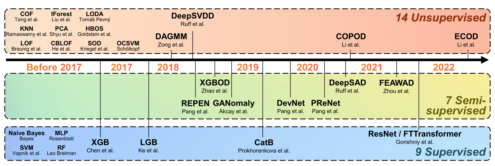

##  Papers 
Official code and data repository of [_**ADBench**: Anomaly Detection Benchmark_](https://arxiv.org/abs/2206.09426) (NeurIPS 2022).

Code URL:  https://github.com/Minqi824/ADBench?tab=readme-ov-file#readme

ADBench is designed as a module, with the calling method being：
```python
from adbench.run import RunPipeline
pipeline = RunPipeline(suffix='ADBench', parallel='supervise', realistic_synthetic_mode=None, noise_type='irrelevant_features')
results = pipeline.run()
```  
This code is in My_Anomaly.py ,can be run directly.
****

### Algorithms

The Figure below shows the algorithms (14 unsupervised, 7 semi-supervised, and 9 supervised algorithms) in ADBench.



#### Added:
#### Pytorch_LSTM, Pytorch_GRU, Keras_LSTM ，SVM_model （with different parameters）,RandomForeast_model（with different parameters）
----

### Environment:
Python3.7.16, Pytorch 1.13, Pytorch-cuda 11.7 Tensorflow2.11, Keras 2.11.0,Numpy 1.21.5 ,Pandas1.3.5 ,Matplotlib3.53 Tqdm4.66.2

### Modification Description：
newADBench is an experimental project for PolyU COMP5121. We have made the following changes to the ADBench paper code:

To quickly present experimental results, only data from the dataset_list_classical class is loaded, without loading data from the dataset_list_cv or dataset_list_nlp classes. Moreover, we have filtered the classical data, choosing only the following three datasets for experiments:

| Number | Data | # Samples | # Features | # Anomaly | % Anomaly | Category |
|:--:|:---:|:---------:|:----------:|:---------:|:---------:|:---:|
|3| backdoor|   95329   |    196     |   2329    |   2.44    | Network|
|9|census|  299285   |    500     |   18568   |   6.20    | Sociology|
|25| musk                                 |   3062    |    166     |    97     |   3.17    | Chemistry   |      

Only one type of irrelevant_features noise is defined, adding 0.1 noise to increase the original dataset by 10% with irrelevant features for interference.

Modification of the Supervised module in the baseline package:

2.1 A new model factory class is defined: Class ModelFactory, and a get_model method is defined to create five custom models based on model_name: Pytorch_LSTM, Pytorch_GRU, keras_lstm_model, SVM_model, and RandomForest_model. To compare with the original SVM and RF algorithms in ADBench, our own SVM_model and RandomForest_model chose different parameters.

2.2 Modification of the supervised class: Pytorch models require tensor input. To maintain the original code structure, supervised needs to add an input parameter Pdata. Additionally, to create models in model_dict using ModelFactory, a lambda anonymous function is used to define a ModelFactory closure for dynamically creating model instances. As shown below, the algorithms starting with lambda in the dictionary are the newly added algorithms:
```python
self.model_dict = {'LR':LogisticRegression,
                   'NB':GaussianNB,
                   'SVM':SVC,
                   'MLP':MLPClassifier,
                   'RF':RandomForestClassifier,
                   'LGB':lgb.LGBMClassifier,
                   'XGB':xgb.XGBClassifier,
                   'CatB':CatBoostClassifier,
                   'Pytorch_LSTM': lambda: ModelFactory(self.model_name, 'LSTM', self.epochs, self.PData).get_model(),
                   'Pytorch_GRU': lambda: ModelFactory(self.model_name, 'GRU', self.epochs, self.PData).get_model(),
                   'keras_lstm_model': lambda: ModelFactory(self.model_name, None, self.epochs, self.PData).get_model(),
                   'SVM_model': lambda: ModelFactory(self.model_name, None, self.epochs, self.PData).get_model(),
                   'RandomForest_model': lambda: ModelFactory(self.model_name, None, self.epochs, self.PData).get_model()
                   }
 ```
2.3 Added five custom model training methods model_flt() and model evaluation methods model_performance() in the supervised class.

Modification of the run module in the ADBench package:

3.1 Added a method to detect GPU devices for Pytorch models, get_pdevice().

3.2 Added a tensor processing class for Pytorch models: class PytorchData(object).

3.3 Modified the initialization method of the RunPipeline class: when in parallel=supervised mode, added five custom model names to the model_dict list.

3.4 Modified the run method of the RunPipeline class: after generating noisy data, an instance of the PytorchData class =PData is created for input during Pytorch model creation. Additionally, when looping through the model_dict dictionary, a new branch is added by using the model_name to create our custom model, then call the model_flt method for training and the model_performance method for evaluation. As shown below: the # new model added part is for adding and training the new model, while the # fit and test model part is for the original model:
```python
if self.model_name in ['Pytorch_LSTM','Pytorch_GRU','keras_lstm_model','SVM_model','RandomForest_model']:
   # new model added
   self.clf = self.clf(seed=self.seed, model_name=self.model_name, PData= PData)
   self.clf.model_flt()
   metrics=self.clf.model_performance()
   time_fit=self.clf.time_fit
   time_inference=self.clf.time_inference
else:
   # fit and test model
   time_fit, time_inference, metrics = self.model_fit()
   results.append([params, model_name, metrics, time_fit, time_inference])
   print(f'Current experiment parameters: {params}, model: {model_name}, metrics: {metrics}, '
   f'fitting time: {time_fit}, inference time: {time_inference}')
```

Following the above modifications, the newADBench project maintains the original structure and output methods of the ADBench codebase, implementing the experimental requirements for comparing 5 additional algorithms with the original paper's algorithms.

### Summary:
After completing machine learning, the ADBench code generates four CSV files in the result folder, presenting a performance comparison table of 10 algorithms under the influence of 10% irrelevant feature interference across three datasets. newADBench maintains the same output method but increases the number of algorithms to 15.

The validation results of various algorithm models on different datasets indicate that there is no universally applicable anomaly detection model that can broadly suit all types of datasets. For different types of datasets, algorithms with good adaptability should be chosen, and newADBench can serve as a tool for selecting anomaly detection algorithms.

Although SVM and Random Forest are relatively traditional, their performance is not inferior to models constructed using neural networks, as seen from the testing effects on several datasets. Considering the factor of training time, it could even be said that SVM and Random Forest algorithms perform better on fully supervised datasets, fully demonstrating the power of mathematical algorithms.
